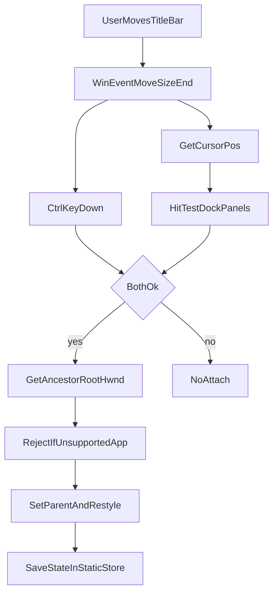

# アタッチ処理の入門

このドキュメントは、**「Ctrl を押しながらタイトルバーを動かしてドックに載せる」**とき、プラグインの内部で何が起きているかを、コードを読む前の段階で把握するための入門です。実装の全体像は [DEVELOPER.md](DEVELOPER.md) にもまとめています。

## ユーザー操作の流れ（おさらい）

1. アタッチしたいアプリを起動する。
2. そのウィンドウの **タイトルバーをドラッグ**する（＝ウィンドウの移動操作）。
3. **Ctrl キーを押したまま**、目的の **Dock パネル内の埋め込みエリア**の上でマウスを離す。
4. 条件を満たしていれば、その外部ウィンドウがパネル内に **埋め込み表示**される。

Ctrl を押していないときはアタッチしないので、**誤って別ウィンドウを載せにくく**なっています。

## なぜ WPF のドラッグ&ドロップではないのか

WPF のドラッグ&ドロップは、だいたい **同じアプリ内**のコントロール同士を想定しています。

今回の「相手」は **別プロセスのトップレベルウィンドウ**です。タイトルバーを掴んでいる間、マウスは **その外部アプリ**がキャプチャしているため、YMM4 側のパネルに「ドロップイベント」が届くとは限りません。

そのため、このプラグインは **OS 全体のウィンドウ操作イベント**を使って、「いま移動が終わった」「カーソルはどこにあるか」「Ctrl は押されているか」を組み合わせてアタッチを判断します。

## 検知の考え方：移動／サイズ変更の「終わり」

Windows には、**ウィンドウの移動やサイズ変更が一段落した**ときに通知する仕組みがあります（アクセシビリティ用の WinEvent）。

このプラグインは、そのうち **移動／サイズ変更終了**に相当するイベントをフックし、

- **どのウィンドウ**について終了したか（イベントに付いてくるウィンドウハンドル）
- **いまマウスはどこにあるか**（カーソル座標）
- **Ctrl が押されているか**（キーボード状態）

を見ます。

実装の入り口は次のファイルです。

- [`Interop/WinEventAttachManager.cs`](../YMM4DockingManager/Interop/WinEventAttachManager.cs)

## どの Dock に載せるか：ヒットテスト

Dock パネル（01〜10）は、それぞれ **WinForms の `Panel`** を `WindowsFormsHost` 越しに表示しています。パネルが「表示中」で、**カーソルがそのパネルの矩形の内側**にあるときだけ、そのパネル番号を候補にします。

複数パネルが重なって見えることは通常ないですが、候補が複数ある場合は **番号の若い方**を優先する実装になっています。

関連するコードは次のあたりです。

- [`Docking/DockTargetRegistry.cs`](../YMM4DockingManager/Docking/DockTargetRegistry.cs)（各パネルが「自分の上にカーソルがあるか」を登録する）
- [`Views/DockTargetView.xaml.cs`](../YMM4DockingManager/Views/DockTargetView.xaml.cs)（登録時のコールバック）

## 対象ウィンドウの決め方

イベントで渡ってくるハンドルは、**タイトルバー部分だけ**の可能性があります。最終的には **トップレベルのルートウィンドウ**（`GetAncestor(..., GA_ROOT)`）にそろえてからアタッチします。これで「本体のウィンドウ」に親子付けできます。

## 埋め込みでやっていること（ざっくり）

条件を満たすと、`DockingController.TryAttach` が呼ばれ、おおまかに次を行います。

1. **拒否チェック**（例: Windows 標準エクスプローラーは相性の問題でアタッチしない）
2. 対象ウィンドウの **元の見た目用スタイル**を覚えておく（あとで戻すため）
3. **Win32 の `SetParent`** で、対象ウィンドウの親を Dock 内の `Panel` に変更する
4. **タイトルバーや枠**に相当するスタイルを落として、パネル内に馴染むようにする
5. サイズをパネルに合わせて **リサイズ**する

Win32 の詳細は [`Docking/ExternalWindowEmbedder.cs`](../YMM4DockingManager/Docking/ExternalWindowEmbedder.cs) と [`Docking/DockingController.cs`](../YMM4DockingManager/Docking/DockingController.cs) にあります。

## 状態の持ち方（タブを切り替えても困らないように）

YMM4 のドッキング UI（AvalonDock）では、タブの切り替えやレイアウト変更のタイミングで **View が作り直される**ことがあります。

そのため「今アタッチしている HWND」や「元のスタイル」などは、**画面用のオブジェクトのメンバー変数だけに持たせない**ようにし、**パネル番号（1〜10）をキーにした static なストア**に置いています。View が再生成されても、ストアを見れば同じウィンドウに再接続できます。

- [`Docking/DockingStateStore.cs`](../YMM4DockingManager/Docking/DockingStateStore.cs)

## サンプルコード（理解用の抜粋）

以下は **そのままコピーして動かすための完成コードではなく**、本リポジトリの実装の流れを追いやすくするための **小さな抜粋**です。定数名・例外処理・ログなどは省略しています。

### WinEvent → UI スレッドで Ctrl・カーソル・パネル判定

`SetWinEventHook` で **移動／サイズ変更終了**だけを購読し、コールバック内では WPF のキー状態を使うため **Dispatcher 経由**で処理します（[`WinEventAttachManager.cs`](../YMM4DockingManager/Interop/WinEventAttachManager.cs) の要点）。

```csharp
// 全プロセス共通で「ウィンドウの移動／サイズ変更が終わった」瞬間だけ通知を受け取る。
// min=max にすると単一イベントだけを購読できる。
_hook = NativeMethods.SetWinEventHook(
    NativeMethods.EVENT_SYSTEM_MOVESIZEEND,
    NativeMethods.EVENT_SYSTEM_MOVESIZEEND,
    IntPtr.Zero,   // コールバックはこの DLL 内（OUTOFCONTEXT）
    _callback,
    0, 0,          // 全プロセス・全スレッド
    NativeMethods.WINEVENT_OUTOFCONTEXT);

private static void OnWinEvent(/* … */ uint eventType, IntPtr hwnd, /* … */)
{
    // コールバックは専用スレッドで来る。hwnd はタイトルバーなど子 HWND のこともある。
    if (eventType != NativeMethods.EVENT_SYSTEM_MOVESIZEEND || hwnd == IntPtr.Zero)
        return;

    // WPF の Keyboard / 以降の UI 更新は Dispatcher 上で行う必要がある。
    Application.Current?.Dispatcher.BeginInvoke(new Action(() =>
    {
        // Ctrl なしは誤アタッチ防止（ユーザーが README で読む挙動）。
        if (!Keyboard.IsKeyDown(Key.LeftCtrl) && !Keyboard.IsKeyDown(Key.RightCtrl))
            return;

        // ドロップ位置の代わりに「移動終了時のカーソル」でヒットテストする。
        if (!NativeMethods.GetCursorPos(out var pt))
            return;

        // 各 Dock が登録した「自分の Panel 上か」を順に試す。
        var panelIndex = DockTargetRegistry.FindPanelIndexUnderCursor();
        if (panelIndex == null) return;

        // 実際の埋め込み・スタイル変更は DockingController 側に集約。
        DockingController.TryAttach(panelIndex.Value, hwnd, out _);
    }));
}
```

### どのパネルか：表示中かつカーソル内を若い番号優先

各 Dock パネルが登録した `IsVisible` / `IsCursorInside` を使い、**パネル番号の昇順**で最初に一致したものを選びます（[`DockTargetRegistry.cs`](../YMM4DockingManager/Docking/DockTargetRegistry.cs)）。

```csharp
public static int? FindPanelIndexUnderCursor()
{
    // 走査中に別スレッドが Register しても安全なよう、短時間だけコピーを取る。
    Entry[] snapshot;
    lock (_lock)
        snapshot = _entries.Values.ToArray();

    // 複数ヒットは通常起きないが、起きたら番号の若い Dock を優先（安定した挙動）。
    foreach (var e in snapshot.OrderBy(x => x.PanelIndex))
    {
        if (!e.IsVisible()) continue;           // タブで隠れているパネルは除外
        if (e.IsCursorInside()) return e.PanelIndex;  // クライアント矩形内のスクリーン座標判定
    }
    return null;
}
```

### アタッチ直前：ルート HWND と拒否チェック

タイトルバー用の子 HWND が来ても **ルートに正規化**してから続行します。そのうえでエクスプローラーなど **非対応アプリ**を弾きます（[`DockingController.cs`](../YMM4DockingManager/Docking/DockingController.cs) の冒頭付近）。

```csharp
public static bool TryAttach(int panelIndex, IntPtr hwnd, out string? error)
{
    error = null;

    // イベントの hwnd がキャプション部分だけのときがある。トップレウィンドウに揃える。
    hwnd = NativeMethods.GetAncestor(hwnd, NativeMethods.GA_ROOT);
    if (hwnd == IntPtr.Zero || !NativeMethods.IsWindow(hwnd))
    {
        error = "ウィンドウが無効です。";
        return false;
    }

    // プロセス名・クラス名を取得 → IsExplorerWindow で拒否（相性の悪いホストを避ける）
    // このパネルに既に別 HWND が載っていれば先に完全デタッチ（discardSavedRestoreTarget: true）
    // GWL_STYLE / GWL_EXSTYLE を退避して DockingStateStore に書き込み
    // DockTargetRegistry 経由で EmbedIntoWinFormsPanel → Resize
    // 成功時 AutoDetachManager に「YMM4 終了時は親だけ外す」デリゲートを登録
}
```

## 全体の流れ（図）



## 次に読むなら

- ビルド・配布・モジュール構成: [DEVELOPER.md](DEVELOPER.md)
- 利用者向けの手順: [README.md](../README.md)
